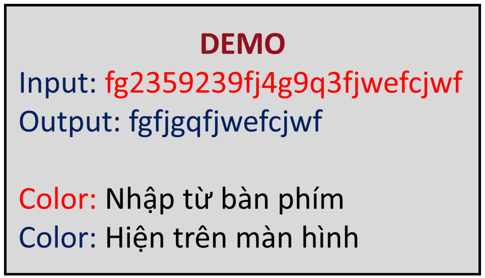

# NASM

## DESCRIP

- Các task này giúp chúng ta làm quen với việc bắt đầu các cú pháp nhập, xuất trong ngôn ngữ ASM, các cú pháp gán và làm quen với vòng lặp, điều kiện

## TÀI LIỆU THAM KHẢO 

[ASM tutorial](https://www.tutorialspoint.com/assembly_programming/index.htm)

### Print "Hello World"

#### *Đề bài: In ra dòng "Hello World!*

```asm
section .data
    msg db 'Hello World!', 10       
    len equ $-msg                 

section .text
    global _start

_start:
    mov eax, 4                      
    mov ebx, 1                      
    mov ecx, msg                    
    mov edx, len
    int 0x80                        

_last:
    mov eax, 1                      
    int 0x80                        
```

- Đây chắc sẽ là chương trình đầu tiên khi chúng ta mới bắt đầu học ASM. Thì về cơ bản thì một chương trình ASM sẽ có 3 phần là `section .data`, `section .bss` và `section .text`. Chương trình trên chỉ có 2 phần là `.data` và `.text` thui nhưng vẫn được coi là một chương trình vì mỗi phần có một nhiệm vụ khác nhau, do yêu cầu của bài này không cần đến nhiệm vụ của phần `.bss` nên trong chương trình không có.
- Trong phần `section .data` sẽ bao gồm những biến mà ta khai báo trước, những biến này sẽ không thể thay đổi khi chạy chương trình. Những cách khai báo biến trong phần này (`db`, `dw`,...) đã có trong tài liệu tham khảo ở trên [ASM tutorial](https://www.tutorialspoint.com/assembly_programming/index.htm) các bạn có thể tham khảo để biết rõ hơn. 
+ Dòng `len equ $-msg ` cho chúng ta biết chiều dài của chuỗi ở trên. Hầu như khi khai báo một chuỗi thì chúng ta phải quan tâm đến chiều dài của nó, bởi vì máy tính lưu theo thứ tự lần lượt và nó sẽ không biết là biến đó có chiều dài là bao nhiêu nếu bạn không lưu lại chiều dài của chúng. Trong đó `len` là tên biến tui muốn lưu chiều dài, `$-msg`được hiểu là nó sẽ lấy vị trí trí con trỏ hiện tại (`len`) trừ đi vị trí có trỏ của `msg` nên nó sẽ ra chiều dài của chuỗi msg (điều này cũng dễ hiểu bởi vì như tôi có nói ở trên là do máy tính nó lưu theo thứ tự lần lượt mà). Nên hầu như 2 câu lệnh này sẽ đi cùng với nhau.
+ Tiếp theo trong phần `section .text` sẽ là phần chứa code của chúng ta, 2 phần trên chỉ có nhiệm vụ khai báo. Về nội dung giá trị truyền vào các thanh ghi `eax`, `ebx`, ... thì các bạn có thể tham khảo [ASM tutorial](https://www.tutorialspoint.com/assembly_programming/index.htm). Một điều mà tui cần quan tâm và hiểu ở đây đó chính là dòng `int 0x80`. Đây là câu lệnh gọi hệ thống và nó sẽ lấy những giá trị đang được lưu ở các thanh ghi để làm việc. Và dù bạn có làm điều gì với các thanh ghi như đẩy giá trị, cộng, trừ, ... thì lệnh này nó sẽ lấy giá trị cuối cùng thay dổi của thanh ghi. Hãy nhớ đến điều này vì nó có quan trọng trong bài tiếp theo trong **TASK 1** này.

### Print Character

#### *Đề bài: Nhập vào một chuỗi vài chỉ in ra những chứ cái trong chuỗi đó*

```asm
section .data
    msg1 db 'Input: '
    len1 equ $-msg1

    msg2 db 'Output: '
    len2 equ $-msg2

    newLine db 10
    lenNewLine equ $-newLine

section .bss 
    msg3 resb 100
    len3 resb 100

section .text
    global _start

_start:
    ;Hien 'Input: '
    mov eax, 4
    mov ebx, 1
    mov ecx, msg1
    mov edx, len1
    int 0x80

    ;Nhap tu ban phim
    mov eax, 3
    mov ebx, 0
    mov ecx, msg3
    mov edx, 100
    int 0x80
    mov [len3], eax

    ;Hien Output
    mov eax, 4
    mov ebx, 1
    mov ecx, msg2
    mov edx, len2
    int 0x80

    ;Xu ly bai toan
    xor esi, esi
    
    step1:
    cmp esi, [len3]
    jge _last
    mov ecx, msg3
    add ecx, esi
    cmp byte [ecx], 'A'
    jl step2
    cmp byte [ecx], 'Z'
    jle print
    cmp byte [ecx], 'a'
    jl step2
    cmp byte [ecx], 'z'
    jle print
    jmp step2

_last:
    mov eax, 4
    mov ebx, 1
    mov ecx, newLine
    mov edx, lenNewLine
    int 0x80

    mov eax, 1
    int 0x80

print:
    mov eax, 4
    mov ebx, 1
    mov ecx, msg3
    add ecx, esi
    mov edx, 1
    int 0x80

    inc esi
    jmp step1

step2:
    inc esi
    jmp step1
```



- Với bài này thì tui sẽ giải quyết với ý tưởng là sẽ so sánh từng giá trị trong chuỗi xem có thoả mãn với yêu cầu và thực hiện in lun kí tự đó. Việc đầu tiên cần là đọc chuỗi từ bàn phím nhập vào và thực hiện lưu chiều dài của chuỗi vào biến `len3`:
```asm

    ; Nhap tu ban phim
    mov eax, 3
    mov ebx, 0
    mov ecx, msg3
    mov edx, 100
    int 0x80
    mov [len3], eax

```
- Khi chúng ta chạy chương trình và nhập giá trị đầu vào từ bàn phím, sau khi nhấn `enter` thì chiều dài của chuỗi (bao gồm cả '\n') sẽ mặc nhiên được lưu lại ở thanh `eax`, và nhiệm vụ của chúng ta đơn giản chỉ là gán lại cái đó vào biến `len3` . Nhưng khi lần đầu tui làm bài này tui đã mắc phải một lỗi sai, đó là:
```asm

    ; Nhap tu ban phim
    mov eax, 3
    mov ebx, 0
    mov ecx, msg3
    mov edx, 100
    mov [len3], eax
    int 0x80
    
```
- Việc thay đổi thứ tự của các dòng lệnh khiến cho chương trình của chúng ta theo một chiều hướng hoàn toàn khác.  Điều tôi muốn nói với các bạn ở đây đó chính là thứ tự làm việc của máy, như ở trên thì thanh `eax` sẽ lưu lại chiều dài của chuỗi nhập từ bàn phím nhưng nó sẽ lưu sau khi lệnh `call` được thực hiên. Bởi vì lệnh `call`sẽ đọc thanh `eax` để biết nó đang ở chế độ `read`, `ebx` ở chế độ `stdin` rùi mới cho chúng ta nhập từ bàn phím. Sau đó `eax` mới lưu chiều dài của chuỗi. Nên muốn lưu lại chiều dài của chuỗi thì chúng ta phải để sau câu lệnh `int 0x80`, phải theo trình tự của máy tính.
- Ý tưởng so sánh của tui chỉ là so sánh với kí tự là các chữ cái trong bảng ASCII, trong `ASM` không có việc so sánh nhiều giá trị cùng một lúc nên việc lọc ra các chữ cái cũng cần nhiều lần điều kiện và việc thực hiện `jmp`, `jl`, `jle`,... là để tạo ra vòng lặp. Cú pháp về việc tạo ra vòng lặp và điều kiện đã được ghi rõ trong [ASM tutorial](https://www.tutorialspoint.com/assembly_programming/index.htm).

- Trong phần so sánh này việc viết sao cho máy hiểu là mình đang so sánh kí tự thứ `k` chứ không phải là toàn bộ bởi vì máy tính chỉ biết được địa chỉ của chuỗi hay kí tự thui, chúng ta cần chú ý:

```asm

	; Máy tính sẽ hiểu câu lệnh này
	mov eax, msg + 2			; Vị trị con trỏ thứ 2 trong chuỗi msg
	
	; Máy tính cũng sẽ hiểu câu lệnh này
		mov ecx, msg
		add ecx, esi			; Vị trí con trỏ thứ esi trong chuối msg

	; Nhưng nếu chúng ta gộp lại như này thì máy tính sẽ không hiểu và lỗi
	mov ecx, msg + esi			; Lỗi

```
- Và khi chúng ta đã biết được vị trí của con trỏ rùi thì tiếp theo chúng ta sẽ có một số sự chú ý trong câu lệnh so sánh
```asm
cmp byte [ecx], 'Z'
```
- Chúng ta đang muốn  so sánh từng kí tự một, mà từng kí tự được lưu thành từng byte một trong máy tính, nên chúng ta cần phải chỉ rõ ra là muốn so sánh cái gì với cái gì để máy tính có thể  hiểu. Ở trên chúng ta đã có địa chỉ của con trỏ ở vị trí thứ `k` trong chuỗi, mà chúng ta cần giá trị của con trỏ đó và cần máy tính hiểu là so sánh dựa trên `byte` đó nên cần phải ghi là `cmp byte [ecx], 'Z'`. Nếu ghi mỗi `cmp [ecx], 'Z'` máy tính sẽ không hiểu và dẫn đến lỗi.
- Sơ đồ bài toán:


## TỔNG KẾT
-   Để hoàn thiện 2 chương trình hiện "Hello World!" và hiện các chữ cái trong chuỗi nhập, ta cần trang bị những kiến thức về các chế độ của thanh ghi (chế độ read, write, exit,...), các cú pháp câu lệnh so sánh, tạo vòng lặp, hiểu việc thực hiện của máy tính để đặt các câu lệnh để phù hợp với mục đích sử dụng.

# Mong WRITEUP này sẽ giúp ích cho các bạn!

```
from KMA
Author: TungDvan
Email: mousefuhlen@gmail.com
```

