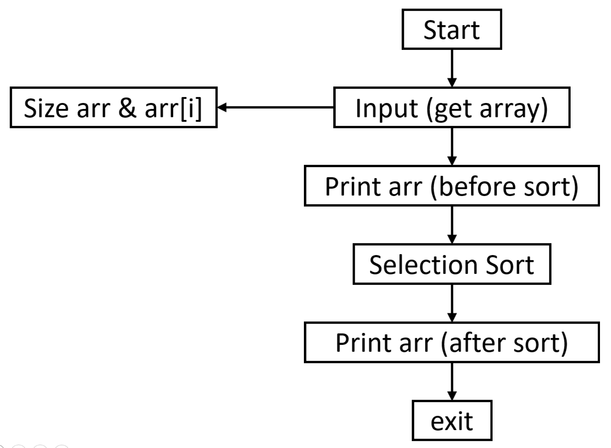
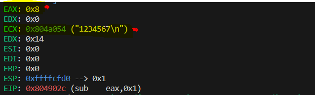

# NASM

## MÔ TẢ

- Trong bài viết này sẽ giúp chúng ta biết cách lưu giá trị của một mảng, xử lý dữ liệu từ bàn phím, hiển thị dữ liệu từ bộ nhớ.

- Bên cạnh đó chúng ta cũng biết thêm được những phép toán toán học nhân `mul` và chia `div`

### Bài toán Selection_Sort

- Về cấu trúc của bài toán thì chương trình chúng ta sẽ được thực thi như sau:

    

- Nhìn qua sơ đồ thì chắc chúng ta sẽ biết cần phải trang bị những gì cho chương trình, chắc chắn sẽ phải có một hàm in mảng, một hàm sort. Vấn đề cốt lõi của bài toán này là vấn đề xử lý **string to number** và **number to string** .

- Bởi vì mọi giá trị ta nhập vào bàn phím đều được lưu dưới dạng kí tự từng `byte` mà chúng ta lại cần *giá trị* của chúng nên phải có bước chuyển **string to number**. Sau 7749 bước đã đạt được mục đích và điều cần là in ra những *giá trị* đó, thì nếu mà in ra *giá trị* thì máy tính sẽ in ra kí tự theo mã `ASCII` của *giá trị* đó, đó lại là lý do vì sao lại cần thêm bước **number to string**.

### Khởi tạo biến number, mảng lưu chuỗi, mảng lưu giá trị

```asm
number dd 0                 ; Number
string times 20 db '', 0    ; String
arr times 300 dd '', 0      ; Array
```

- Chúng ta cần phải biết cần lưu những cái gì vào từng biến. Ví dụ: 

    - `number` là *giá trị* thế nên ta chỉ cần một vùng nhớ để lưu *giá trị* này, và số đó có thể rất lớn nên dẽ dùng `doubleword` để lưu.
    
    - `string` là chuỗi, mà chuỗi tạo nên bởi các kí tự, mỗi kí tự được biểu diễn bởi một số trên mã `ASCII` nên chỉ cần `byte` để lưu, còn số `20` thể hiện là chuỗi có thể lưu tối đa `20` kí tự, chúng ta nên để `,0` ở cuối phần khai báo để biết nó sẽ kết thúc ở đó. Việc thêm `,0` ở cuối rất là quan trong để tránh những vấn đề nhảy lung tung khi truy cập hay muốn trích xuất giá trị từ bộ nhớ.

    - `arr` là một mảng dùng để lưu những giá trị, những giá trị thì nó giống như number nên sẽ dùng `doubleword`, còn số `300` thể hiện mảng này có thể lưu trữ tối đa `300` giá trị number.

### String To Number



- Khi chúng ta nhập từ bàn phím thì thanh ghi `ebx` sẽ lưu địa chỉ của kí tự đầu tiên của chuỗi, thanh ghi `eax` sẽ lưu chiều dài của chuỗi đó bao gồm cả kí tự xuống dòng nên cần phải nhớ trừ đi `1` để ra chiều dài thực thế của chuỗi đó.

- Ta với các kí tự digit '0'-'9' nằm trong khoảng 0x30-0x39, ta convert từ chuỗi số sang số nguyên bằng cách tách từng phần tử của chuỗi, trừ đi `0x30` và nhân dần với `0xa` trước bước lặp để thêm vào digit tiếp theo, còn nếu vo.

    ```asm
    _stringToNum:           
    ; step1, step2
    ; input: string = ebx, lenNum = ecx
    ; output: number = eax
        xor eax, eax
        xor esi, esi

        ; esi la danh dau ki tu thu x
        ; eax luu gia tri
        ; edx luu he so 10 va gia tri cua ki tu

        mov byte [sign], 0x0     ; danh dau la so duong
        cmp byte [ebx], 0x2d    ; 0x2d = '-'
        jne step1
        add esi, 1              ; 1 la am, 0 la duong
        mov byte [sign], 0x1
        step1:
            xor edx, edx
            mov edx, 0xa
            mul edx
            mov dl, byte [ebx + esi]
            sub edx, 0x30       ; 0x30 = '0'
            add eax, edx
            add esi, 0x1
            cmp esi, ecx
            jl step1

        cmp byte [sign], 0x1     ; 1 la am, 0 la duong
        jne step2
        neg eax
        step2:
            xor esi, esi
            xor ecx, ecx
            xor edx, edx
            xor ebx, ebx
    ret
    ```

- Đoạn code trên bao gồm cả cách xử lý chuỗi âm bằng cách so sánh kí tự đầu tiên với kí tự `'-'` lưu vào một biến `sign` đánh dấu, sau khi xử lý xong phần giá trị thì kiểm tra biến `sign`, nếu là âm thì sử dụng câu lệnh `neg` để đổi dấu giá trị đó

### Number To String

```asm
_numToString:               
; step3, step4
; input: number = eax
; output: string, lenNum = esi
    xor ebx, ebx
    xor ecx, ecx
    xor esi, esi
    
    mov byte [sign], 0x0         ; danh dau la so duong (0)

    test eax, eax
    jns step3                   ; nhay neu khong am
    mov byte [sign], 0x1
    neg eax

    step3:
        xor edx, edx
        mov ebx, 0xa            ; chia lien tiep cho 10
        div ebx
        add edx, 0x30           ; 0x30 = '0'
        push edx
        add ecx, 0x1
        cmp eax, 0x0
        jne step3

    cmp byte [sign], 0x1
    jne step4
    mov edx, 0x2d
    push edx
    add ecx, 0x1

    step4:
        pop edx
        mov [string + esi], edx
        add esi, 1
        cmp esi, ecx
        jl step4

    xor eax, eax
    xor ebx, ebx
    xor ecx, ecx
    xor edx, edx
ret
```


- Để giải quyết vấn đề này, ta làm ngược lại `stringToNum`. Lấy ra từng đơn vị, cộng với `0x30` và đẩy vào `stack`, sau đó `pop` chúng ra và đưa vào 1 biến. Thực hiện in chúng ra với biến lưu từng digits.

- Có một lưu ý ở đây là việc push một thanh ghi vào `stack` có thể xảy ra xung đột nếu ta pop khi thanh ghi đó đang không ở trên cùng `stack`, việc đó có thể sử dụng debugger để soát lỗi.

- Một điều lưu ý khác khi ta xử dụng `div`, mỗi vòng lặp chúng ta cần phải làm sạch thanh `edx`, bởi vì khi khi chia cho 4 byte thì sẽ là thanh `edx:eax` với `edx` là bit cao, nếu chúng ta không làm sạch thanh `edx` sau mỗi vòng lặp thì thanh `edx` đang lưu giá trị số dư của vòng lặp trước và nó tính là bit cao của một số khác


