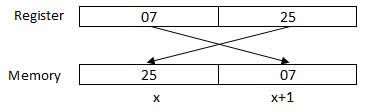

# Assembly - GIỚI THIỆU

## Ngôn ngữ Assembly là gì?

- Mỗi máy tính cá nhân có một bộ vi xử lý, nơi mà quản lý cá hoạt động số học, logic và điều khiển các hoạt động của máy tính.

- Mỗi họ bộ vi xử lý có bộ hướng dẫn riêng trong việc xử lý các hoạt động khác nhau như nhập thông tin từ bàn phím, hiện ra ngoài màn hình biểu diễn các công việc khác. Những bộ hướng dẫn đó được gọi là 'Hướng dẫn ngôn ngữ máy'.

- Một bộ xử lý chỉ hiểu được hướng dẫn ngôn ngữ máy, nơi chỉ có các bit 0 và 1. Tuy nhiên, ngôn ngữ máy thì cũng rất mơ hồ và phức tạp trong việc phát triển phần mềm. Nên ngôn ngữ bậc thấp ASM được thiết kế cho một họ bộ vi xử lý đại diện cho nhiều cấu trúc khác nhau trong mã (code) tượng trưng và dưới dạng dễ hiểu hơn.

## Thuận lợi của ngôn ngữ Assembly

- Hiểu về ngôn ngữ Assembly sẽ giúp nhận thức được:

    ```
    - Cách mà chương trình giao tiếp với hệ điều hành (OS: Operating System), bộ vi xử lý và BIOS.

    - Cách mà dữ liệu được thể hiện trong bộ nhớ và các thiết bị bên ngoài khác.

    - Cách mà bộ xử lý truy cập và thi hành lệnh.

    - Cách hướng dẫn truy cập và xử lý dữ liệu.

    - Cách mà một chương trình truy cập vào thiết bị bên ngoài.
    ```

- Một thuận lợi khác trong viêc sử dụng ngôn ngữ Assembly

    ```
    - Nó đòi hỏi ít bộ nhớ và thời gian thi hành hơn.

    - Nó cho phép các công việc phức tạp dành riêng cho phần cứng một cách cụ thể hơn.

    - Nó phù hợp cho các công việc về thời gian.

    - Nó phù hợp nhất trong việc viết các chương trình dịch vụ ngắt và các chương trình trong bộ nhớ khác.
    ```

## Đặc trưng cơ bản của một phần cứng máy tính

- Phần cứng nội bộ chính của một máy tính bao gồm bộ xử lý, bộ nhớ và các thanh ghi. Các thanh ghi thành phần bộ xử lý, nơi giữ dữ liệu và địa chỉ. Khi thực hiện một chương trình, hệ thống sẽ sao chép nó từ thiết bị bên ngoài vào bộ nhớ bên trong. Bộ xử lý sẽ thực hiện các lệnh của chương trình.

- Đơn vị cơ bản của bộ nhớ máy tính là `bit`; nó có thể là `ON` (1) hoặc `OFF`(0) và một nhóm 8 bit liên quan sẽ tạo nên 1 `byte` trên hầu hết các máy tính hiện đại.

- Vì vậy, *bit chẵn lẻ* được sử dụng để làm cho số bit trong một *byte số lẻ*. Nếu tính chẵn lẻ là chẵn, hệ thống sẽ giả định rằng đã có lỗi chẵn lẻ (mặc dù hơi hiếm), nguyên nhân có thể do lỗi phần cứng hoặc nhiễu điện.

- Bộ xử lý sẽ hỗ trợ các kích thước dữ liệu sau:

    - Word: một mục dữ liệu 2-byte
    - Doubleword: một mục dữ liệu 4-byte (32 bit)
    - Quadword: một mục dữ liệu 8-byte (64 bit)
    - Paragraph: một vùng 16-byte (128 bit)
    - Kilobyte: 1024-byte
    - Megabyte: 1,048,576-byte

## Hệ thống số nhị phân (2)

- Mọi hệ thống số đều sử dụng kí hiệu vị trí, tức là *mỗi trị ví* trong đó một chữ số được viết có một giá trị khác nhau. Mỗi vị trí là luỹ thừa của cơ số, là 2 đối với **hệ thống số nhị phân**, và các luỹ thừa này bắt đầu từ 0 và tăng dần thêm 1.

- Theo dõi bảng sau đây, bảng sẽ hiện thị giá tị vị trí của số nhị phân 8 bit, trong đó các bit đều được bật hết

    |Giá trị bit|1|1|1|1|1|1|1|1|
    |--|--|--|--|--|--|--|--|--|
    |Giá trị vị trí là luỹ thừa cơ số 2|128|64|32|16|8|4|2|1|
    Số bit|7|6|5|4|3|2|1|0|

- Giá trị của số nhị phân được dựa trên sự hiện diện của các bit 1 và giá trị vị trí của chúng, nên giá trị của số nhị phân đã cho là:

    - 1 + 2 + 4 + 8 + 16 + 32 + 64 + 128 = 255 hoặc có thể bằng 2<sup>8</sup> 

## Hệ thống số thập lục phân (16)

- Hệ thống số thập lục phân dùng hệ 16, những chữ số trong này nằm trong phạm vi từ 0 đến 15. Bằng sự quy ước từ trước thì các chữ cái từ A đến F sẽ biển diễn các giá trị từ 10 đến 15.

- Số thập lục phân trong tin học được sử dụng để viết tắt các biểu diễn nhị phân dài dòng. Về cơ bản, hệ thống số thập lục phân biểu diễn một dữ liệu nhị phân bằng việc chia mỗi `byte` làm đôi, và biểu diễn giá trị của mỗi nửa `byte`. Theo dõi bảng sau để thấy giá trị tương đương của hệ 10, hệ 16, hệ 2

    |Số thập phân|Số nhị phân|Số thập lục phân|
    |--|--|--|
    |0|0|0|
    |1|1|1|
    |2|10|2|
    |3|11|3|
    |4|100|4|
    |5|101|5|
    |6|110|6|
    |7|111|7|
    |8|1000|8|
    |9|1001|9|
    |10|1010|A|
    |11|1011|B|
    |12|1100|C|
    |13|1101|D|
    |14|1110|E|
    |15|1111|F|
    |||

- Để chuyển đổi một số nhị phân sang số thập lục phân tương đương, chia nó thành các nhóm 4 liên tiếp bắt đầu từ bên phải và viết các nhóm đó thành các kí tự tương ứng của số thập lục phân

    - **Ví dụ:** số nhị phân `1000 1100 1101 0001`
    thì ta sẽ chia thành các nhóm 4 từ bên phải là `1000` `1100` `1101` `0001` và nó sẽ tương đương `8` `C` `D` `1` và số đó là `8DC1`

## Số học nhị phân

- Bảng sau minh họa bốn quy tắc đơn giản để cộng nhị phân

    |(i)|(ii)|(iii)|(iv)|
    |--|--|--|--|
    ||||1|
    |0|1|1|1|
    |+0|+0|+1|1|
    |=0|=1|=10|1|
    |||

- Quy tắc (iii) và (iv) hiển thị việc mang bit 1 vào vị trí bên trái tiếp theo.

    - **Ví dụ:** 
        |Số thập phân|Số nhị phân|
        |--|--|
        |60|00111100|
        |+42|00101010|
        |=102|01100110|
        |||

- Giá trị nhị phân âm được biểu thị bằng **ký hiệu bù hai**. Theo quy tắc này, để chuyển đổi một số nhị phân thành giá trị âm của nó là **đảo ngược** các giá trị bit của nó và thêm `1`.

    - **Ví dụ:**

        |||
        |--|--|
        |Số 53|00110101|
        |Đảo ngược các bit|11001010|
        |Thêm 1|00000001|
        |Số -53|11001011|
        |||

- Để trừ một giá trị cho một giá trị khác, hãy chuyển số bị trừ sang dạng `bù hai` và cộng các số đó.

    - **Ví dụ:** 53 - 42 = 53 + (-42)
        |||
        |--|--|
        |Số 42|00101010|
        |Đảo ngược các bit số 42|11010101|
        |Thêm 1|00000001|
        |Số -42|11010110|
        |Số 53|00110101|
        |53 - 42 = 11|00001011|

        - Tràn 1 bit cuối cùng bị mất

## Địa chỉ dữ liệu trong bộ nhớ

- Quá trình thông qua, quá trình mà bộ xử lý điều khiển thực hiện các hướng dẫn được biết đến như là chu trình *tìm - giải mã - thực thi* hay *chu trình thực hiện*. Nó bao gồm 3 bước sau:

    ```
    - Tìm chỉ dẫn từ bộ nhớ
    - Giải mã hoặc xác định hướng dẫn
    - Thực hiện hướng dẫn
    ```

- Bộ xử lý có thể truy cập một hoặc nhiều byte bộ nhớ cùng một lúc. Chúng ta hãy xem xét số thập lục phân 0725H. Con số này sẽ yêu cầu hai byte bộ nhớ. Byte bậc cao hoặc byte quan trọng nhất là 07 và byte bậc thấp là 25.

- Bộ xử lý lưu trữ dữ liệu theo chuỗi byte ngược, nghĩa là một byte thứ tự thấp được lưu trữ ở địa chỉ bộ nhớ thấp và một byte thứ tự cao được lưu trữ ở địa chỉ bộ nhớ cao. Vì vậy, nếu bộ xử lý mang giá trị 0725H từ thanh ghi vào bộ nhớ, nó sẽ chuyển 25 đầu tiên đến địa chỉ bộ nhớ thấp hơn và 07 đến địa chỉ bộ nhớ tiếp theo.

    

- Khi bộ xử lý lấy dữ liệu số từ bộ nhớ để đăng ký, nó lại đảo ngược các byte. Có hai loại địa chỉ bộ nhớ
    ```
    - Absolute address (Địa chỉ tuyệt đối) - tham chiếu trực tiếp đến vị trí cụ thể.
    - Segment address (Địa chỉ phân đoạn hoặc phần bù) - địa chỉ bắt đầu của phân đoạn bộ nhớ có giá trị phần bù.
    ```
    