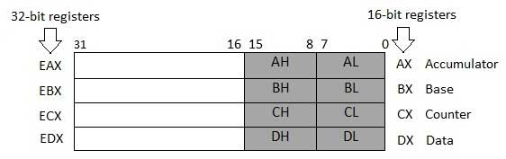
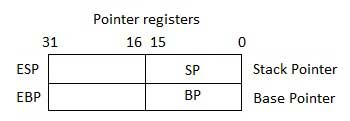
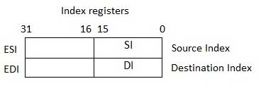

# Assembly - Registers

- Hoạt động của bộ xử lý chủ yếu liên quan đến việc xử lý dữ liệu. Dữ liệu này có thể được lưu trữ trong bộ nhớ và được truy cập từ đó. Tuy nhiên, việc đọc dữ liệu từ và lưu trữ dữ liệu vào bộ nhớ sẽ làm chậm bộ xử lý vì nó liên quan đến các quy trình phức tạp trong việc gửi yêu cầu dữ liệu qua bus điều khiển và vào bộ nhớ lưu trữ cũng như nhận dữ liệu qua cùng một kênh.

- Để tăng tốc hoạt động của bộ xử lý, bộ xử lý bao gồm một số vị trí lưu trữ bộ nhớ trong, được gọi là các thanh ghi.

- Các thanh ghi lưu trữ các phần tử dữ liệu để xử lý mà không cần phải truy cập vào bộ nhớ. Một số lượng hạn chế các thanh ghi được tích hợp vào chip xử lý.

## Thanh ghi bộ xử lý (Processor Registers)

- Có mười thanh ghi bộ xử lý 32 bit và sáu thanh ghi bộ xử lý 16 bit trong kiến ​​trúc IA-32. Các thanh ghi được nhóm thành ba loại:

    - **General registers** (thanh ghi chung)
    - **Control registers, and** (thanh ghi điều khiển)
    - **Segment registers** (thanh ghi phân đoạn)

- Trong thanh ghi chung (*General registers*) được chia thành các nhóm sau:

    - **Data registers** (thanh ghi dữ liệu)
    - **Pointer registers** (thanh ghi con trỏ)
    - **Index registers** (thanh ghi mục lục)

## **Data registers** (thanh ghi dữ liệu)

- Bốn thanh ghi dữ liệu 32 bit được sử dụng cho các phép toán số học, logic và các phép toán khác. Các thanh ghi 32 bit này có thể được sử dụng theo ba cách:

    - Là các thanh ghi dữ liệu 32 bit hoàn chỉnh: `EAX`, `EBX`, `ECX`, `EDX`.

    - Nửa dưới của thanh ghi 32 bit có thể được sử dụng làm bốn thanh ghi dữ liệu 16 bit: `AX`, `BX`, `CX` và `DX`.

    - Nửa dưới và nửa trên của bốn thanh ghi 16 bit nêu trên có thể được sử dụng làm tám thanh ghi dữ liệu 8 bit: `AH`, `AL`, `BH`, `BL`, `CH`, `CL`, `DH` và `DL`.

        

- Một số thanh ghi dữ liệu này có công dụng cụ thể trong các phép tính số học:

    - `AX` **là bộ tích lũy chính**, nó được sử dụng trong đầu vào/đầu ra và hầu hết các lệnh số học. Ví dụ, trong phép nhân, một toán hạng được lưu trong thanh ghi `EAX` hoặc `AX` hoặc `AL` tùy theo kích thước của toán hạng.

    - `BX` **được gọi là thanh ghi cơ sở** vì nó có thể được sử dụng trong việc đánh địa chỉ theo chỉ số.

    - `CX` **được gọi là thanh ghi đếm**, vì các thanh ghi `ECX`, `CX` lưu trữ *số vòng lặp* trong các hoạt động lặp lại.

    - `DX` được gọi là thanh ghi dữ liệu . Nó cũng được sử dụng trong các hoạt động *đầu vào/đầu ra*. Nó cũng được sử dụng với thanh ghi `AX` cùng với `DX` cho các phép toán nhân và chia có giá trị lớn.

    ## **Pointer registers** (thanh ghi con trỏ)

    - Các thanh ghi con trỏ là các thanh ghi `EIP,` `ESP` và `EBP` 32 bit và các phần bên phải 16 bit tương ứng `IP`, `SP` và `BP`. Có ba loại thanh ghi con trỏ

        - **Con trỏ lệnh** `IP`: Thanh ghi `IP` 16 bit lưu trữ địa chỉ **offset** của lệnh tiếp theo sẽ được thực thi. `IP` kết hợp với thanh ghi `CS` (dưới dạng `CS:IP`) cung cấp địa chỉ đầy đủ của lệnh hiện tại trong đoạn mã.

        - **Con trỏ ngăn xếp** `SP`: Thanh ghi `SP` 16 bit cung cấp giá trị **offset** trong ngăn xếp chương trình. `SP` liên kết với thanh ghi `SS` (`SS:SP`) đề cập đến vị trí hiện tại của dữ liệu hoặc địa chỉ trong ngăn xếp chương trình.

        - **Con trỏ cơ sở** `BP` - Thanh ghi `BP` 16 bit chủ yếu giúp tham chiếu các biến tham số được truyền cho chương trình con. Địa chỉ trong thanh ghi `SS` được kết hợp với **offset** trong `BP` để lấy vị trí của tham số. `BP` cũng có thể được kết hợp với `DI` và `SI` làm thanh ghi cơ sở cho việc đánh địa chỉ đặc biệt.

            

## **Index registers** (thanh ghi mục lục)

- Các thanh ghi chỉ mục 32 bit, `ESI` và `EDI` và các phần ngoài cùng bên phải 16 bit của chúng. `SI` và `DI`, được sử dụng để đánh địa chỉ theo chỉ số và đôi khi được sử dụng trong phép cộng và phép trừ. Có hai bộ con trỏ chỉ mục

    - **Chỉ mục nguồn** `SI`: Nó được sử dụng làm chỉ mục nguồn cho các hoạt động chuỗi.

    - **Chỉ mục đích** `DI`: Nó được sử dụng làm chỉ mục đích cho các hoạt động chuỗi.

        

## **Control registers, and** (thanh ghi điều khiển)

- Thanh ghi con trỏ lệnh 32 bit (*32-bit instruction pointer register*) và thanh ghi cờ 32 bit (*32-bit flags register*) kết hợp được coi là thanh ghi điều khiển.

- Nhiều lệnh liên quan đến so sánh và tính toán toán học cũng như thay đổi trạng thái của cờ và một số lệnh có điều kiện khác kiểm tra giá trị của các cờ trạng thái này để đưa luồng điều khiển đến vị trí khác.

- Các bit cờ phổ biến là

    - **Overflow Flag** `OF`: Nó cho biết sự tràn của bit dữ liệu bậc cao (bit ngoài cùng bên trái) sau một phép toán số học đã ký.

    - **Direction Flag** `DF`: Nó xác định hướng trái hoặc phải để di chuyển hoặc so sánh dữ liệu chuỗi. Khi giá trị DF bằng 0, thao tác chuỗi sẽ theo hướng từ trái sang phải và khi giá trị được đặt thành 1, thao tác chuỗi sẽ theo hướng từ phải sang trái.

    - **Interrupt Flag** `IF`: Nó xác định xem các ngắt bên ngoài như mục nhập bàn phím, v.v., có bị bỏ qua hoặc xử lý hay không. Nó vô hiệu hóa ngắt ngoài khi giá trị bằng 0 và cho phép ngắt khi được đặt thành 1.

    - **Trap Flag** `TF`: Nó cho phép thiết lập hoạt động của bộ xử lý ở chế độ một bước. Chương trình DEBUG mà chúng tôi sử dụng đặt cờ bẫy để chúng tôi có thể thực hiện từng bước thực thi từng lệnh một.

    - **Sign Flag** `SF`: Nó hiển thị dấu của kết quả của phép tính số học. Cờ này được đặt theo dấu của mục dữ liệu sau phép toán số học. Dấu hiệu được biểu thị bằng bậc cao nhất của bit ngoài cùng bên trái. Kết quả dương sẽ xóa giá trị của SF thành 0 và kết quả âm sẽ đặt giá trị đó thành 1.

    - **Zero Flag** `ZF`: Nó cho biết kết quả của phép tính số học hoặc so sánh. Kết quả khác 0 sẽ xóa cờ 0 thành 0 và kết quả 0 đặt cờ 0 thành 1.

    - **Auxiliary Carry Flag** `AF`: Nó chứa giá trị mang từ bit 3 đến bit 4 sau một phép toán số học; dùng cho các phép tính chuyên biệt. AF được thiết lập khi phép toán số học 1 byte gây ra lỗi mang từ bit 3 sang bit 4.

    - **Parity Flag** `PF`: Nó cho biết tổng số bit 1 trong kết quả thu được từ một phép tính số học. Số chẵn 1 bit sẽ xóa cờ chẵn lẻ thành 0 và số lẻ 1 bit sẽ đặt cờ chẵn lẻ thành 1.

    - **Carry Flag** `CF`: Nó chứa giá trị mang 0 hoặc 1 từ bit bậc cao (ngoài cùng bên trái) sau một phép toán số học. Nó cũng lưu trữ nội dung của bit cuối cùng của thao tác dịch chuyển hoặc xoay.

- Bảng sau cho biết vị trí của các bit cờ trong thanh ghi Cờ 16 bit:

    ||||||||||||||||||
    |--|--|--|--|--|--|--|--|--|--|--|--|--|--|--|--|--|
    |Flag|||||O|D|I|T|S|Z||A||P||C|
    |Bit no|15|14|13|12|11|10|9|8|7|6|5|4|3|2|1|0|
    ||||||||||||||||||

## **Segment registers** (thanh ghi phân đoạn)

- Phân đoạn là các khu vực cụ thể được xác định trong chương trình để chứa dữ liệu, mã và ngăn xếp. Có ba phân đoạn chính

    - **Code Segment** Nó chứa tất cả các hướng dẫn sẽ được thực thi. Thanh ghi đoạn mã 16 bit hoặc thanh ghi `CS` lưu trữ địa chỉ bắt đầu của đoạn mã.

    - **Data Segment** Nó chứa dữ liệu, hằng số và vùng làm việc. Thanh ghi phân đoạn dữ liệu 16 bit hoặc thanh ghi `DS` lưu trữ địa chỉ bắt đầu của phân đoạn dữ liệu.

    - **Stack Segment** Nó chứa dữ liệu và địa chỉ trả về của các thủ tục hoặc chương trình con. Nó được triển khai dưới dạng cấu trúc dữ liệu 'stack'. Thanh ghi Phân đoạn ngăn xếp hoặc thanh ghi `SS` lưu trữ địa chỉ bắt đầu của ngăn xếp.

- Ngoài các thanh ghi `DS`, `CS` và `SS`, còn có các thanh ghi phân đoạn bổ sung khác - `ES` (phân đoạn bổ sung), `FS` và `GS`, cung cấp các phân đoạn bổ sung để lưu trữ dữ liệu.

- Trong lập trình hợp ngữ, một chương trình cần truy cập vào các vị trí bộ nhớ. Tất cả các vị trí bộ nhớ trong một phân đoạn đều liên quan đến địa chỉ bắt đầu của phân đoạn đó. Một phân đoạn bắt đầu bằng một địa chỉ chia hết cho `16` hoặc thập lục phân `10`. Vì vậy, chữ số thập lục phân ngoài cùng bên phải trong tất cả các địa chỉ bộ nhớ như vậy là `0`, thường không được lưu trong thanh ghi phân đoạn.

- Thanh ghi phân đoạn lưu trữ các địa chỉ bắt đầu của một phân đoạn. Để có được vị trí chính xác của dữ liệu hoặc lệnh trong một phân đoạn, cần phải có giá trị bù (hoặc dịch chuyển). Để tham chiếu bất kỳ vị trí bộ nhớ nào trong một phân đoạn, bộ xử lý kết hợp địa chỉ phân đoạn trong thanh ghi phân đoạn với giá trị offset của vị trí đó.