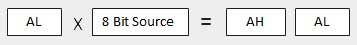
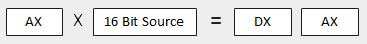
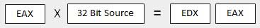
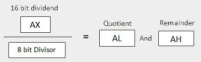
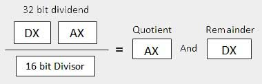
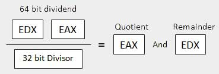

# Assembly - Arithmetic Instructions

## Hướng dẫn INC

- Lệnh INC được sử dụng để tăng toán hạng lên một. Nó hoạt động trên một toán hạng duy nhất có thể nằm trong thanh ghi hoặc trong bộ nhớ.

    ### Cú pháp

- Lệnh `inc` có cú pháp sau:

    ```
    inc destination
    ```
    
    - Toán hạng đích (*operand destination*) có thể là toán hạng `8` bit, `16` bit hoặc `32` bit.

- Ví dụ

    ```asm
    inc ebx	     ; tăng thêm một đơn vị thanh ghi 32-bit
    inc dl       ; tăng thêm một đơn vị thanh ghi 8-bit
    inc [count]  ; tăng thêm một đơn vị biến count 
    ```

## Hướng dẫn DEC

- Lệnh `dec` được sử dụng để giảm toán hạng đi một. Nó hoạt động trên một toán hạng duy nhất có thể nằm trong thanh ghi hoặc trong bộ nhớ.

    ### Cú pháp

- Lệnh `dec` có cú pháp sau:

    ```
    dec destination
    ```
    
    - Toán hạng đích (*operand destination*) có thể là toán hạng `8` bit, `16` bit hoặc `32` bit.

- Ví dụ:

    ```asm
    segment .data
        count dw  0         ; biến count = 0    
        value db  15        ; biến value = 15
        
    segment .text
        inc [count]         ; tăng count lên 1 đơn vị
        dec [value]         ; giảm value đi 1 đơn vị
        
        mov ebx, count      ; đưa địa chỉ biến count vào ebx
        inc word [ebx]      ; tăng giá trị của địa chỉ ebx lên 1  
                            ; đơn vị
        
        mov esi, value      ; đưa địa chỉ biến value vào esi
        dec byte [esi]      ; giảm giá trị của địa chỉ esi đi 1 
                            ; đơn vị
    ```

## Hướng dẫn ADD và SUB

- Lệnh `add` và `sub` được sử dụng để thực hiện phép cộng/trừ đơn giản dữ liệu nhị phân theo kích thước `byte`, `word` và `doubleword`, tức là để cộng hoặc trừ các toán hạng `8` bit, `16` bit hoặc `32` bit tương ứng.

    ### Cú pháp

    - Các lệnh ADD và SUB có cú pháp sau:

        ```
        ADD/SUB	destination, source
        ```
    
- Lệnh ADD/SUB có thể diễn ra giữa:

    - Thanh ghi với thanh ghi *(VD: add eax, eax)*
    - Bộ nhớ với thanh ghi *(VD: add eax, [num1])*
    - Thanh ghi với bộ nhớ *(VD: add [num1], eax)*
    - Thanh ghi với dữ liệu không đổi *(VD: add eax, 23)*
    - Bộ nhớ với dữ liệu không đổi *(VD: add [num1], 23)*

- Tuy nhiên, giống như các lệnh khác, các thao tác **từ bộ nhớ** đến **bộ nhớ** không thể thực hiện được bằng cách sử dụng các lệnh `add/sub`. Hoạt động `add` hoặc `sub` thiết lập hoặc xóa **overflow** và **carry flags**.


## Lệnh MUL/IMUL

- Có hai hướng dẫn để nhân dữ liệu nhị phân. Lệnh `mul` (nhân) xử lý dữ liệu không dấu và `imul` (nhân số nguyên) xử lý dữ liệu có dấu. Cả hai hướng dẫn đều ảnh hưởng đến **Carry** và **Overflow flag**

    ### Cú pháp

    - Cú pháp của lệnh `mul/imul` như sau:

    ```
    mul/imul multiplier
    ```

    - Số bị nhân trong cả hai trường hợp sẽ ở dạng tích lũy, tùy thuộc vào kích thước của số bị nhân và số nhân và kết quả được tạo cũng được lưu trữ trong hai thanh ghi tùy thuộc vào kích thước của toán hạng. Phần sau giải thích các hướng dẫn MUL với ba trường hợp khác nhau (2 x 3 thì 2 là số bị nhân và 3 là số nhân)

        - **TH1: Khi hai byte được nhân lên**

            - Số bị nhân nằm trong thanh ghi `al` và số nhân là một byte trong bộ nhớ hoặc trong một thanh ghi khác. Sản phẩm có mã `ax`. 8 bit **bậc cao** của sản phẩm được lưu trữ trong `ah` và 8 bit **bậc thấp** được lưu trữ trong `al`.

                

        - **TH2: Khi hai giá trị word được nhân lên**

            - Số bị nhân phải nằm trong thanh ghi `ax` và số nhân là một từ trong bộ nhớ hoặc một thanh ghi khác. Ví dụ, đối với một lệnh như `mul dx`, bạn phải lưu trữ số nhân trong `dx` và số nhân trong `ax`.

            - Sản phẩm kết quả là một `doubleword`, sẽ cần hai thanh ghi. Phần thứ tự cao (ngoài cùng bên trái) được lưu trữ trong `dx` và phần thứ tự thấp hơn (ngoài cùng bên phải) được lưu trữ trong `ax`.

                

        - **TH3: Khi hai giá trị doubleword được nhân lên**

            - Khi nhân hai giá trị từ kép, số bị nhân phải ở trong `eax` và số nhân là giá trị từ kép được lưu trong bộ nhớ hoặc trong một thanh ghi khác. Sản phẩm được tạo ra được lưu trữ trong các thanh ghi `edx:eax`, tức là 32 bit bậc cao được lưu trong thanh ghi `edx` và 32 bit bậc thấp được lưu trong thanh ghi `eax`.

                


## Lệnh DIV/IDIV

- Phép chia kết quả ra hai phần tử - thương và số dư. Trong trường hợp nhân, tràn không xảy ra vì các thanh ghi có độ dài gấp đôi được sử dụng để giữ kết quả. Tuy nhiên, trong trường hợp chia, tràn có thể xảy ra. Bộ xử lý tạo ra một ngắt nếu tràn xảy ra.

- Lệnh `div` (chia) được sử dụng cho dữ liệu không dấu và `idiv` (chia số nguyên) được sử dụng cho dữ liệu có dấu.

    ### Cú pháp
    
    - Cú pháp của lệnh `div/idiv` như sau:

    ```
    div/idiv divisior
    ```

    - Số bị chia nằm trong một bộ tích lũy. Cả hai lệnh đều có thể hoạt động với toán hạng `8` bit, `16` bit hoặc `32` bit. Hoạt động này ảnh hưởng đến tất cả sáu cờ trạng thái. Phần sau giải thích ba trường hợp chia với kích thước toán hạng khác nhau (5 : 2 thì 5 là số bị chia, 2 là số chia)

        - **TH1: Khi số chia là 1 byte**

            - Số bị chia được giả định nằm trong thanh ghi `ax` (`16` bit). Sau khi chia, thương sẽ vào thanh ghi `al`, số dư sẽ vào thanh ghi `ah`.

                

        - **TH2: Khi số chia là một word**

            - Số bị chia được giả định là dài `32` bit và nằm trong các thanh ghi `dx:ax`. `16` bit bậc cao nằm trong `dx` và 16 bit bậc thấp nằm trong `ax`. Sau khi chia, thương số `16` bit sẽ chuyển đến thanh ghi `ax` và phần còn lại `16` bit sẽ chuyển đến thanh ghi `dx`.

                

        - **TH3: Khi số chia là một doubleword**

            - Số bị chia được giả định là dài `64` bit và nằm trong các thanh ghi `edx:eax`. `32` bit bậc cao nằm trong `edx` và 32 bit bậc thấp nằm trong `eax`. Sau khi chia, thương số `32` bit sẽ chuyển vào thanh ghi `eax` và phần còn lại `32` bit sẽ chuyển vào thanh ghi `edx`.

                