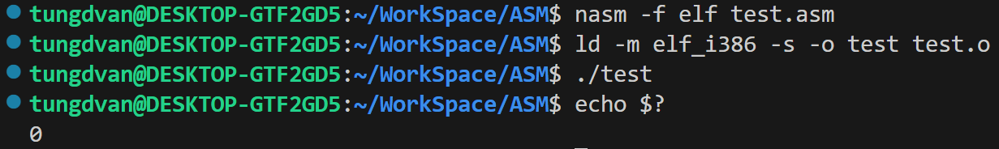
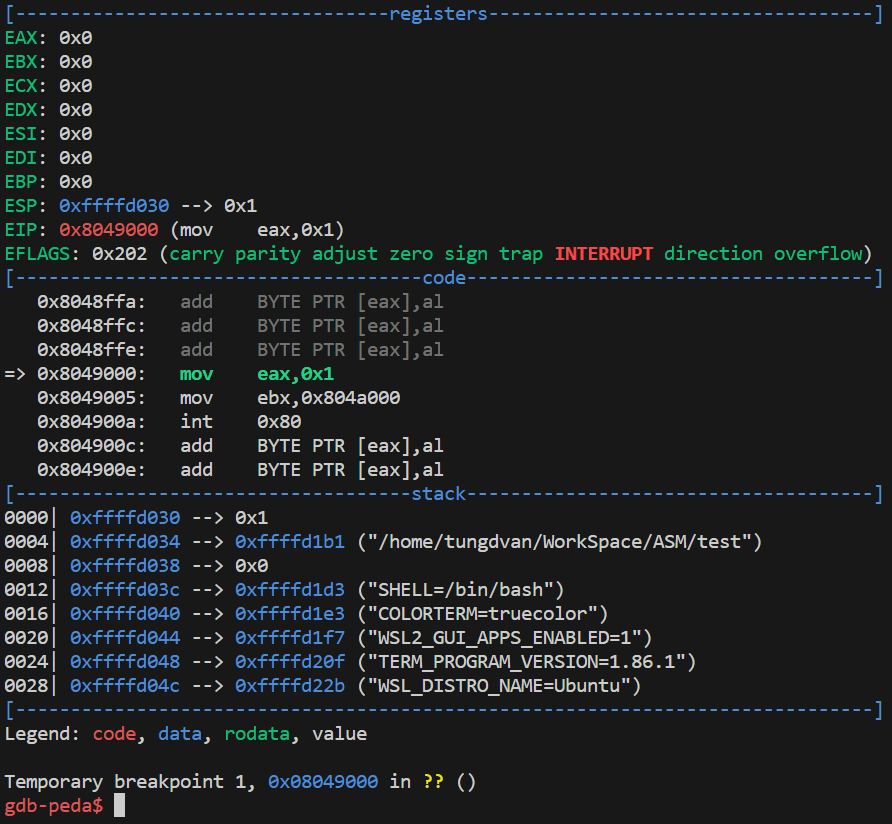
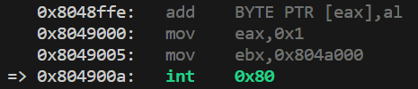
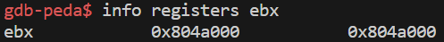
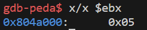
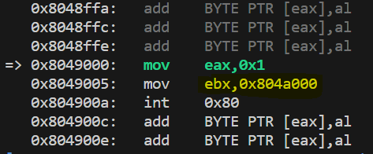
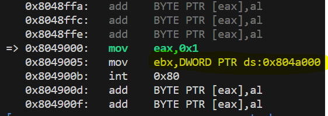

# NASM

## MÔ TẢ

- Trong bài viết này chúng ta sẽ sử dụng `section .data` để khai báo dữ liệu số đơn giản.

- Bên cạnh đó cũng học cách xem dữ liệu trên ngăn xếp thông qua `gdb-peda` và làm cách để tải dữ liệu từ ngăn xếp vào những thanh ghi.

### KHAI BÁO MỘT BIẾN

- Điều chúng ta cần làm khi khai báo một biến hay bất kì dữ liệu nào là trong phần này chúng ta cần cung cấp 3 thứ khác nhau: `name` (tên cho dữ liệu chúng ta cần cung cấp), `type` (loại dữ liệu thực sự chỉ có kích thước như số byte), `value` (một giá trị ban đầu cho biến đó). Cú pháp như sau:

    ```
    name type value
    ```

    - Ví dụ:

        ```asm
        num1 db 2
        num2 dw 3
        msg3 db "Tung dep trai co mot khong co hai"
        ```

- Trong đó, thì ở ví dụ trên chúng ta có thấy `db`: được sử dụng để xác định 1 byte dữ liệu. Bên cạnh đó còn có một số kiểu dữ liệu khác như `dw`, `dd`, `dq`, `dt`

    ||||
    ---|---|---
    db | Define Byte | 1 byte
    dw | Define Word | 2 byte
    dd | Define Doubleword | 4 byte
    dq | Define Quadword | 8 byte
    dt | Define Ten Bytes | 10 byte

    - Bây giờ các bạn có thể nhận thấy chúng ta chỉ đang xác định số lượng byte và bit được liên kết với biến. Chúng ta thực sự không có bất cứ điều gì nói về dữ liệu nào thực sự được lưu trữ ở đây (ví dụ trong C thì có kiểu `int`, `float`, `char`). Và lý do bởi vì mỗi phần tử dữ liệu được lưu trữ thực chất chỉ là dữ liệu nhị phân nên không có sự phần biệt nào giữa bất kì loại nào khác nhau. Giống như bạn biết nó có thể là một số nguyên, nó có thể là một kí tự, nó có thể là một string,... không có cách nào thực sự phân biệt được rằng. Chúng ta chỉ thực sự phân biệt nó bằng dung lượng thực tế và bộ nhớ.

### TẢI DỮ LIỆU TỪ NGĂN XẾP VÀO THANH GHI

- Với những kiến thức đã được biết đến ở trên và trong bài 1, hãy dự đoán xem chương trình này gõ `echo $?` ở `Terminal` thì kết quả hiện ra màn hình sẽ là gì:

    ```asm
    ; file test.asm

    section .data
        num db 5

    section .text
    global _start

    _start:
        mov eax, 1
        mov ebx, num
        int 0x80
    ```

- Nếu bạn có suy nghĩ số `5` xuất hiện đầu tiên thì nó cũng là một tin vui bởi vì điều đấy đó chứng tỏ rằng tôi với bạn cũng có điểm chung vì đó cũng là điều tôi nghĩ tới ban đầu.

- Số `0` sẽ là con số được nhắc tới ở đây (Hình ảnh như dưới).

    

- Vì vậy điều đã xảy ra ở đây, chúng ta cần phải thực sự xem xét từng bước của chương trình này và cách tốt nhất là dùng `gdb debugger` bằng câu lệnh `gdb test` và `start`.

    

- Ta sẽ dùng câu lệnh `stepi` để đến được bước tiếp theo trong chương trình và từ đó để xem được cái gì đã được lưu vào trong thanh `ebx`, ta sẽ `stepi` đến `call`.

    

- Để xem được thông tin trong thanh `ebx` thì dùng câu lệnh `info registers ebx`.

    

- Vì vậy bạn có thể đang hỏi là giá trị này là điều gì đang xảy ra ở đây. Câu trả lời cho điều đó là giá trị `num` thực sự đang lưu trữ là địa chỉ của dữ liệu cho biến đó nên nó lưu trữ **vị trí** trên ngắn xếp nơi số `5` nằm, để nó cung cấp cho chúng ta một **địa chỉ** chứ không phải **giá trị** thực sự.

- Để chứng minh điều đó tui sẽ sử dụng câu lệnh `x/x $ebx`. Nó sẽ in ra cho chúng ta những gì nằm trong ngăn xếp tại vị trí `ebx`.

    

    - Ở đây nó hiển thị địa chỉ là `0x804a000` và giá trị là `0x05`. Vì vậy nó thực sự hiển thị cho bạn địa chỉ cũng như địa chỉ của `5`.

    - Vậy tại sao lại là số `0`, bởi vì `0` là thứ tự **đầu tiên** của địa chỉ nơi số `5` được lưu trữ.

- Câu hỏi cuối cùng mà chúng ta còn lại ở đây bây giờ là làm cách nào chúng tôi nhận được giá trị `5` trong địa chỉ đó. Và câu trả lời là chúng ta chỉ cần thêm dấu `[]` ở `num` như thế này `mov ebx, [num]`

    ```asm
    ; file test.asm

    section .data
        num db 5

    section .text
    global _start

    _start:
        mov eax, 1
        mov ebx, [num]
        int 0x80
    ```

    - Khi thêm dấu `[]` nó sẽ tạo ra một kiểu tham chiếu khác thay vì di chuyển vào **địa chỉ** vào cửa sổ đăng kí thì nó sẽ đi đến **địa chỉ** đó và lấy **giá trị** được lưu ở đó và chuyển giá trị đó vào cửa số đăng kí.

    - Khi ra gõ `echo $?` thì sẽ hiện như sau

        

    - Khi ta vào `gdb debugged` để xem xem những gì đã thay đổi

        - Khi chưa thêm dấu `[]` 

            

        - Sau khi thêm dấu `[]`

             


## THỬ THÁCH NHO NHỎ CUỐI BÀI   

- **Bài 1:** Hãy đoán xem là chương trình này sau khi biên dịch khi gõ `echo $?` ở `terminal` thì sẽ hiện ra như thế nào:

    ```asm
    section .data
        num1 db 5
        num2 db 6

    section .text
    global _start

    _start:
    mov eax, 1
    mov ebx, num2
    int 0x80
    ```
        
    - Đáp án ở cuối bài 3 (phần tiếp theo). Gợi ý: màn hình sẽ hiện một trong ba số sau (0 hoặc 1 hoặc 2) 

- **Bài 2:** Hãy đoán xem là chương trình này sau khi biên dịch khi gõ `echo $?` ở `terminal` thì sẽ hiện ra như thế nào:

    ```asm
    section .data
        num1 dd 5
        num2 db 6

    section .text
    global _start

    _start:
    mov eax, 1
    mov ebx, num2
    int 0x80
    ```
        
    - Đáp án ở cuối bài 3 (phần tiếp theo). Gợi ý: màn hình sẽ hiện một trong bốn số sau (0 hoặc 1 hoặc 2 hoặc 4)  

## GIẢI ĐÁP THỬ THÁCH BÀI 1

- Hãy đoán xem là chương trình này sau khi biên dịch khi gõ `echo $?` ở `terminal` thì sẽ hiện ra như thế nào:

    ```asm
    section .data

    section .text
    global _start

    mov eax, 1
    mov ebx, 1
    int 0x80

    _start:
    mov eax, 1
    mov ebx, 2
    int 0x80 
    ```

- **Đáp án:** màn hinh sẽ hiện ra số 2
- **Giải thích:** Về cơ bản chương trình nó được thực thi thì đến `global _start:` nó sẽ nhảy đến phần nhãn `_start:` để thực hiện các dòng lệnh bên dưới `_start:`

